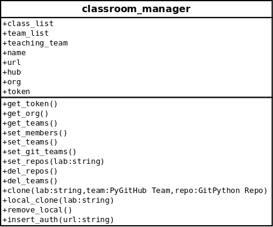

# service_moss
A repo to complete work on the moss component of the service  

### Subtasks:  
* Maintain a list of repos (there may be more than 1 student per group & repo)  
* Use [GitPython](http://gitpython.readthedocs.io/en/stable/index.html) to clone repos into the lab folder, subfoldered  per group  
* Call mossScript using subprocess  
* Use requests to pull all references & store them in results
* Send notification containing results to teaching team  

# NOTES
* Submission will be in ./submissions/*.*
* Base code ./base/*.*
